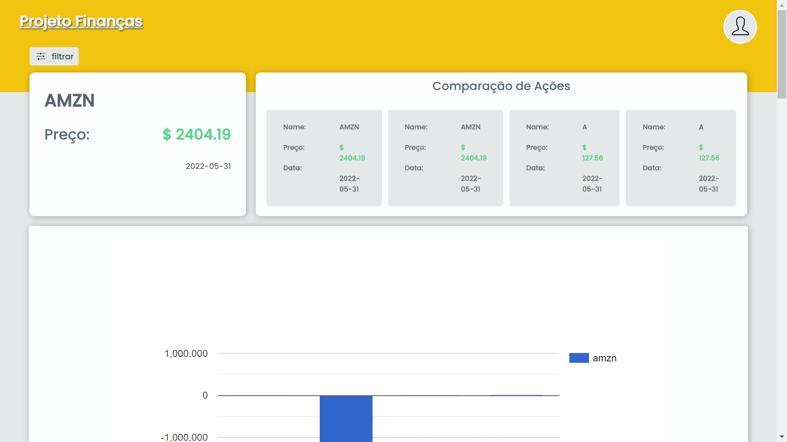
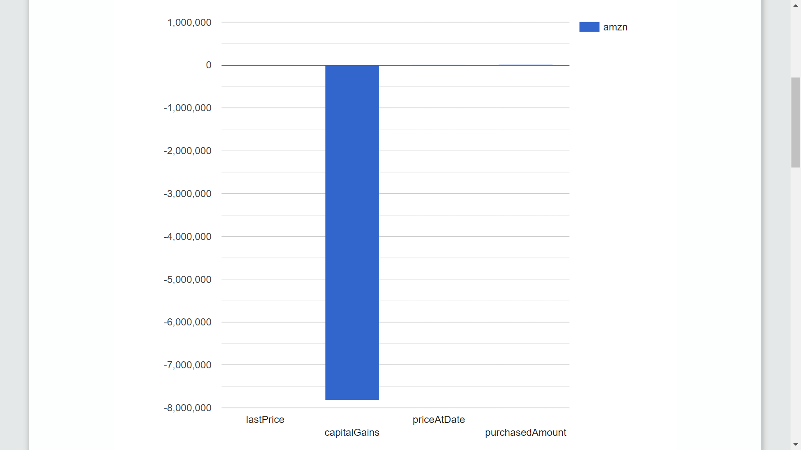
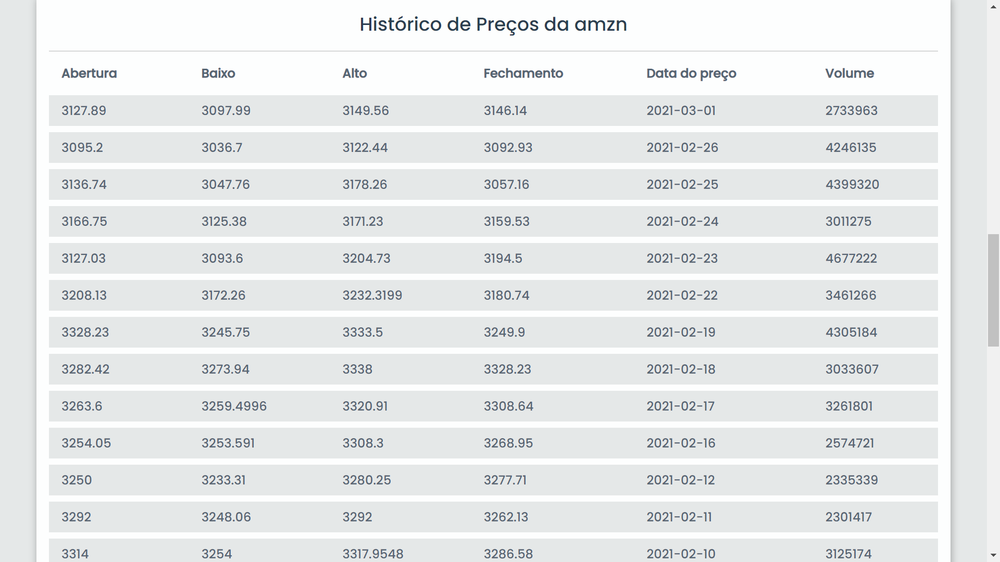
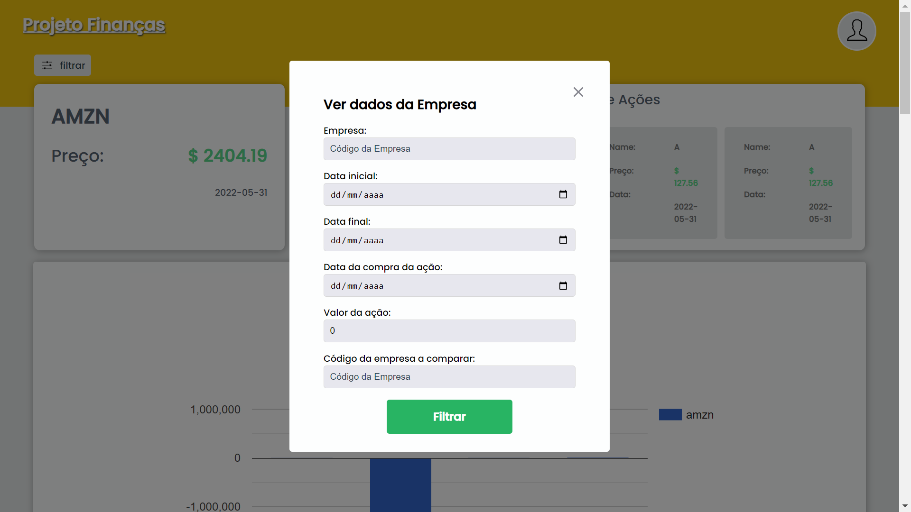

# :rocket: Projeto Dashboard de Ações Financeiras

## :book: Descrição do Projeto

Neste projeto para uma vaga na Alive App Brasil, tive o dever de construir um Dashboard para obter dados de ações financeiras de diversas empresas. è um Dashboard simples, com algumas informações, contendo um botão que possibilita filtrar os dados das empresas, como qual empresa você deseja saber sobre as açõe, uma data especifica de uma certa quantidade de ação, ou simplesmente ver um histórico de ações dessa determinada empresa, também comparar as ações de uma empresa com uma outra empresa qualquer.

O layout da aplicação é bem simples, contendo algumas seções com informações, gráfico com uma projeção de ganhos e uma lista contendo um histórico de ações. No canto superior esquerdo á um botão para filtrar as informações, no canto superior direito um botão de acesso a infomações do usuário (infelizmente essa função ainda não está disponível no momento).

Além da aplicação Frontend, o Backend já desenvolvido, este que será usado para obtenção dos dados, fazendo uma requisição na API, utilizando a <a style="text-decoration: none" href="(https://www.alphavantage.co">Alpha Vantage</a> para busca de dados.

### :point_right: Este respositório contém 

   - uma pasta <strong>server</strong> (Back-End da Aplicação)
   - uma pasta <strong>web</strong> (Front-End da Aplicação)

### :dart: Layout da Aplicação

Imagens do Layout da Aplicação:






### :gear: Pré-requisitos

Antes de começar, você vai precisar ter instalado em sua máquina as sequintes ferramentas:
[Git](https://git-scm.com), [Node.js](https://nodejs.org/en/).

### :label: Rodando o Back End (servidor)

```bash 
   # clone este respositório
   $ git clone <https://github.com/TiagoM13/hiring-frontend.git>

   # Acesse a pasta do projeto no terminal
   $ cd hiring-frontend

   # Vá para a pasta Server
   $ cd server

   # Instale as dependências
   $ npm install

   # Execute a aplicação em modo de desenvolvimento
   $ npm run dev

   # O servidor inciará na porta:3001
```

### :label: Rodando o Front End (servidor)

```bash 
   # Acesse a pasta do projeto no terminal
   $ cd hiring-frontend

   # Vá para a pasta Server
   $ cd web

   # Instale as dependências
   $ npm install

   # Execute a aplicação em modo de desenvolvimento
   $ npm run dev

   # O servidor inciará na porta:300o - acesse <http://localhost:300>
```

### :hammer_and_wrench: Tecnologias 

As seguintes ferramentas foram usadas na construção do projeto:

- React
- Typescript
- Fetch
- React Google Charts
- React Modal
- Styled Components
- Vscode
